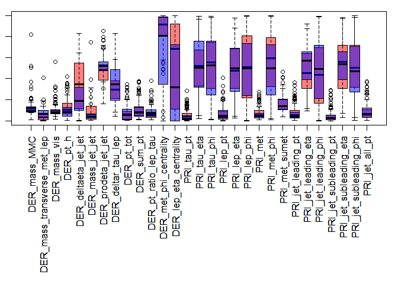
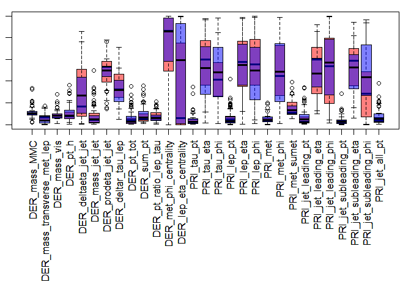
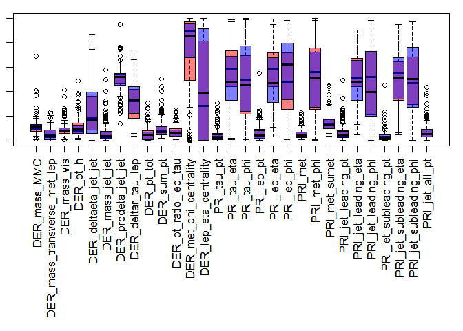
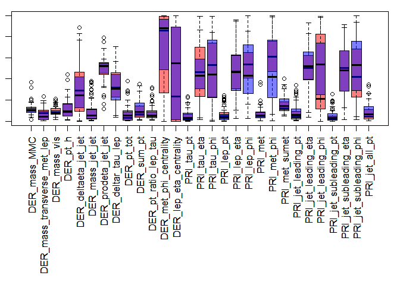
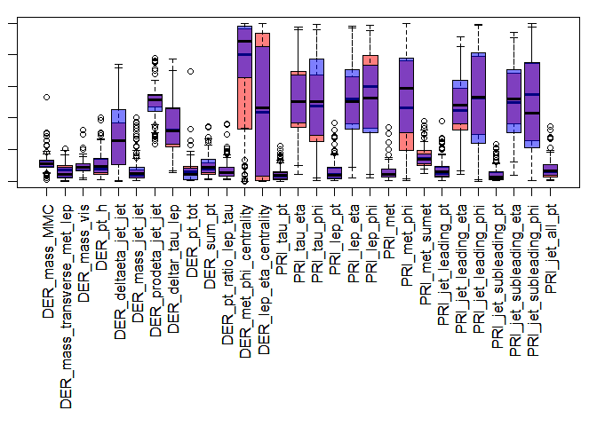
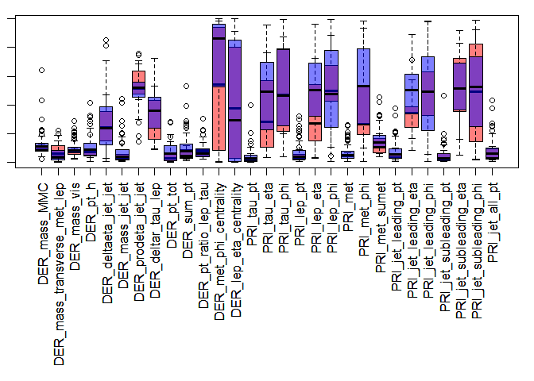

# Higgs-ML sets details
Rail Suleymanov  
Thursday, February 19, 2015  

# Load sets

```r
setA <- read.csv("training (A).csv")
setB <- read.csv("training (B).csv")
setC <- read.csv("training (C).csv")
setD <- read.csv("training (D).csv")
setE <- read.csv("training (E).csv")
setF <- read.csv("training (F).csv")
A_labs <- setA[, 33]; B_labs <- setB[, 33]; C_labs <- setC[, 33]
D_labs <- setD[, 33]; E_labs <- setE[, 33]; F_labs <- setF[, 33]
A_cols_rm <- c(1, 24, 32, 33)
B_cols_rm <- c(1, 2, 24, 32, 33)
C_cols_rm <- c(1, 6, 7, 8, 14, 24, 28, 29, 30, 32, 33)
D_cols_rm <- c(1, 2, 6, 7, 8, 14, 24, 28, 29, 30, 32, 33)
E_cols_rm <- c(1, 6, 7, 8, 14, 24, 25, 26, 27, 28, 29, 30, 31, 32, 33)
F_cols_rm <- c(1, 2, 6, 7, 8, 14, 24, 25, 26, 27, 28, 29, 30, 31, 32, 33)
setA <- setA[, -A_cols_rm]
setB <- setB[, -B_cols_rm]
setC <- setC[, -C_cols_rm]
setD <- setD[, -D_cols_rm]
setE <- setE[, -E_cols_rm]
setF <- setF[, -F_cols_rm]
```

# Scale values

```r
for (col in colnames(setA)) {
    min_c <- min(setA[, col])
    max_c <- max(setA[, col])
    setA[, col] <- (setA[, col] - min_c) / (max_c - min_c)
}
for (col in colnames(setB)) {
    min_c <- min(setB[, col])
    max_c <- max(setB[, col])
    setB[, col] <- (setB[, col] - min_c) / (max_c - min_c)
}
for (col in colnames(setC)) {
    min_c <- min(setC[, col])
    max_c <- max(setC[, col])
    setC[, col] <- (setC[, col] - min_c) / (max_c - min_c)
}
for (col in colnames(setD)) {
    min_c <- min(setD[, col])
    max_c <- max(setD[, col])
    setD[, col] <- (setD[, col] - min_c) / (max_c - min_c)
}
for (col in colnames(setE)) {
    min_c <- min(setE[, col])
    max_c <- max(setE[, col])
    setE[, col] <- (setE[, col] - min_c) / (max_c - min_c)
}
for (col in colnames(setF)) {
    min_c <- min(setF[, col])
    max_c <- max(setF[, col])
    setF[, col] <- (setF[, col] - min_c) / (max_c - min_c)
}
```

# Report number of signal/background in each set

```r
sbTot <- c(length(A_labs[A_labs == "s"]), length(A_labs[A_labs == "b"]))
sbTot <- rbind(sbTot, c(length(B_labs[B_labs == "s"]), length(B_labs[B_labs == "b"])))
sbTot <- rbind(sbTot, c(length(C_labs[C_labs == "s"]), length(C_labs[C_labs == "b"])))
sbTot <- rbind(sbTot, c(length(D_labs[D_labs == "s"]), length(D_labs[D_labs == "b"])))
sbTot <- rbind(sbTot, c(length(E_labs[E_labs == "s"]), length(E_labs[E_labs == "b"])))
sbTot <- rbind(sbTot, c(length(F_labs[F_labs == "s"]), length(F_labs[F_labs == "b"])))
rownames(sbTot) <- c("Set A", "Set B", "Set C", "Set D", "Set E", "Set F")
colnames(sbTot) <- c("Signal", "Background")
sbTot
```

```
##       Signal Background
## Set A  31894      36220
## Set B    571       3858
## Set C  27005      42977
## Set D    705       6857
## Set E  23933      49857
## Set F   1559      24564
```

# Plot some examples

```r
A_subset_100s <- (setA[A_labs == "s", ])[sample(sbTot[1, 1], 100, replace = F), ]
A_subset_100b <- (setA[A_labs == "b", ])[sample(sbTot[1, 1], 100, replace = F), ]
B_subset_100s <- (setA[B_labs == "s", ])[sample(sbTot[1, 1], 100, replace = F), ]
B_subset_100b <- (setA[B_labs == "b", ])[sample(sbTot[1, 1], 100, replace = F), ]
C_subset_100s <- (setA[C_labs == "s", ])[sample(sbTot[1, 1], 100, replace = F), ]
C_subset_100b <- (setA[C_labs == "b", ])[sample(sbTot[1, 1], 100, replace = F), ]
D_subset_100s <- (setA[D_labs == "s", ])[sample(sbTot[1, 1], 100, replace = F), ]
D_subset_100b <- (setA[D_labs == "b", ])[sample(sbTot[1, 1], 100, replace = F), ]
E_subset_100s <- (setA[E_labs == "s", ])[sample(sbTot[1, 1], 100, replace = F), ]
E_subset_100b <- (setA[E_labs == "b", ])[sample(sbTot[1, 1], 100, replace = F), ]
F_subset_100s <- (setA[F_labs == "s", ])[sample(sbTot[1, 1], 100, replace = F), ]
F_subset_100b <- (setA[F_labs == "b", ])[sample(sbTot[1, 1], 100, replace = F), ]
```

# A set

```r
par(mar = c(14, 1, 1, 1))
boxplot(A_subset_100s, col = rgb(1, 0, 0, 0.5), las = 2, height = 500)
boxplot(A_subset_100b, col = rgb(0, 0, 1, 0.5), las = 2, add = T, height = 500)
```

 

# B set

```r
par(mar = c(14, 1, 1, 1))
boxplot(B_subset_100s, col = rgb(1, 0, 0, 0.5), las = 2, height = 400)
boxplot(B_subset_100b, col = rgb(0, 0, 1, 0.5), las = 2, add = T, height = 400)
```

 

# C set

```r
par(mar = c(14, 1, 1, 1))
boxplot(C_subset_100s, col = rgb(1, 0, 0, 0.5), las = 2, height = 300)
boxplot(C_subset_100b, col = rgb(0, 0, 1, 0.5), las = 2, add = T, height = 300)
```

 

# D set

```r
par(mar = c(14, 1, 1, 1))
boxplot(D_subset_100s, col = rgb(1, 0, 0, 0.5), las = 2, height = 600)
boxplot(D_subset_100b, col = rgb(0, 0, 1, 0.5), las = 2, add = T, height = 600)
```

 

# E set

```r
par(mar = c(14, 1, 1, 1))
boxplot(E_subset_100s, col = rgb(1, 0, 0, 0.5), las = 2, height = 700)
boxplot(E_subset_100b, col = rgb(0, 0, 1, 0.5), las = 2, add = T, height = 700)
```

 

# F set

```r
par(mar = c(14, 1, 1, 1))
boxplot(F_subset_100s, col = rgb(1, 0, 0, 0.5), las = 2, height = 800)
boxplot(F_subset_100b, col = rgb(0, 0, 1, 0.5), las = 2, add = T, height = 800)
```

 
