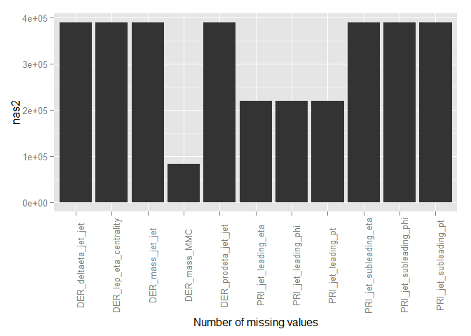
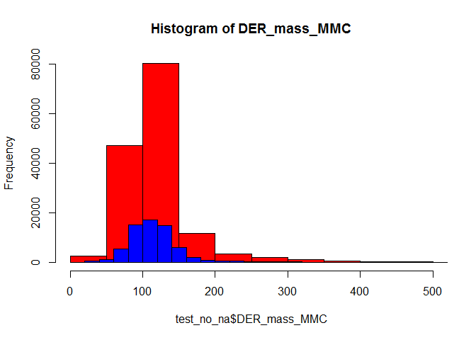

# Higgs-ML summary
Rail Suleymanov  
Monday, February 02, 2015  

# Load data
## Training data
Read training data, find number of missing points for each variable, remove missing points.

```r
train_f <- "training.csv"
train <- read.csv(train_f)
train_no_na <- data.frame(train)
features <- colnames(train)
nas1 <- vector("integer", length = length(features))
for (feature in seq_along(features)) {
    ina <- train[, feature] == -999.0
    nas1[feature] <- sum(ina)
}
for (feature in seq_along(features)) {
    ina <- train_no_na[, feature] == -999.0
    train_no_na <- train_no_na[!ina, ]
}
```

Number of missing values for each variable.

```r
library(ggplot2)
```

```
## Warning: package 'ggplot2' was built under R version 3.1.2
```

```r
nas <- data.frame(features, nas1)
nas <- nas[nas1 != 0, ]
q <- qplot(x = features, y = nas1, data = nas, geom = "bar", stat = "identity")
q + theme(axis.text.x = element_text(angle = 90)) + xlab("Number of missing values")
```

 

## Test data
Read test data, find number of missing points for each variable, remove missing points.

```r
test_f <- "test.csv"
test <- read.csv(test_f)
test_no_na <- data.frame(test)
features <- colnames(test)
nas2 <- vector("integer", length = length(features))
for (feature in seq_along(features)) {
    ina <- test[, feature] == -999.0
    nas2[feature] <- sum(ina)
}
for (feature in seq_along(features)) {
    ina <- test_no_na[, feature] == -999.0
    test_no_na <- test_no_na[!ina, ]
}
```

Number of missing values for each variable.

```r
nas <- data.frame(features, nas2)
nas <- nas[nas2 != 0, ]
q <- qplot(x = features, y = nas2, data = nas, geom = "bar", stat = "identity")
q + theme(axis.text.x = element_text(angle = 90)) + xlab("Number of missing values")
```

 

# Details of some of features

```r
s_train <- summary(train_no_na)
s_test <- summary(test_no_na)
```

## 1) Estimated mass of the Higgs boson candidate (DER_mass_MMC)

```r
main <- "Histogram of DER_mass_MMC"
ylab <- "Frequency"
leg <- c("Test", "Train")
hist(test_no_na$DER_mass_MMC, breaks = 50, col = "red", ylab = ylab, main = main, xlim = c(0, 500))
hist(train_no_na$DER_mass_MMC, breaks = 50, col = "blue", add = T)
```

 

Test set statistics: Min.   :   9.112  , 1st Qu.:  93.348  , Median : 113.455  , Mean   : 122.771  , 3rd Qu.: 133.674  , Max.   :1949.261  

Train set statistics: Min.   :  9.878  , 1st Qu.: 93.320  , Median :113.230  , Mean   :122.816  , 3rd Qu.:133.456  , Max.   :988.199  

## 2) Transverse mass between the missing transverse energy and the lepton (DER_mass_transverse_met_lep)

```r
main <- "Histogram of DER_mass_transverse_met_lep"
ylab <- "Frequency"
leg <- c("Test", "Train")
hist(test_no_na$DER_mass_transverse_met_lep, 
     breaks = 50, col = "red", ylab = ylab, main = main, xlim = c(0, 200))
hist(train_no_na$DER_mass_transverse_met_lep, breaks = 50, col = "blue", add = T)
```

 

Test set statistics: Min.   :  0.00  , 1st Qu.: 11.42  , Median : 26.93  , Mean   : 35.10  , 3rd Qu.: 51.63  , Max.   :527.92  

Train set statistics: Min.   :  0.00  , 1st Qu.: 11.32  , Median : 26.96  , Mean   : 35.27  , 3rd Qu.: 52.20  , Max.   :594.29  

## 3) Invariant mass of the hadronic tau and the lepton (DER_mass_vis)

```r
main <- "Histogram of DER_mass_vis"
ylab <- "Frequency"
leg <- c("Test", "Train")
hist(test_no_na$DER_mass_vis, breaks = 50, col = "red", ylab = ylab, main = main, xlim = c(0, 200))
hist(train_no_na$DER_mass_vis, breaks = 50, col = "blue", add = T)
```

 

Test set statistics: Min.   :  7.352  , 1st Qu.: 57.343  , Median : 70.981  , Mean   : 78.623  , 3rd Qu.: 88.442  , Max.   :983.204  

Train set statistics: Min.   :  7.33  , 1st Qu.: 57.27  , Median : 70.93  , Mean   : 78.50  , 3rd Qu.: 88.37  , Max.   :789.54  

## 4) Modulus of the vector sum of the transverse momentum of the hadronic tau, the lepton,
## and the missing transverse energy vector (DER_pt_h)

```r
main <- "Histogram of DER_pt_h"
ylab <- "Frequency"
leg <- c("Test", "Train")
hist(test_no_na$DER_pt_h, breaks = 50, col = "red", ylab = ylab, main = main, xlim = c(0, 500))
hist(train_no_na$DER_pt_h, breaks = 50, col = "blue", add = T)
```

 

Test set statistics: Min.   :   0.112  , 1st Qu.:  57.477  , Median :  94.221  , Mean   : 110.919  , 3rd Qu.: 145.197  , Max.   :1337.187  

Train set statistics: Min.   :   0.12  , 1st Qu.:  57.83  , Median :  94.71  , Mean   : 111.43  , 3rd Qu.: 145.82  , Max.   :1053.81  

## 5) Absolute value of the pseudorapidity separation between the two jets (DER_deltaeta_jet_jet)

```r
main <- "Histogram of DER_deltaeta_jet_jet"
ylab <- "Frequency"
leg <- c("Test", "Train")
hist(test_no_na$DER_deltaeta_jet_jet, breaks = 50, col = "red", ylab = ylab, main = main, xlim = c(0, 10))
hist(train_no_na$DER_deltaeta_jet_jet, breaks = 50, col = "blue", add = T)
legend("topright", pch = 1, col = c("red", "blue"), legend = leg)
```

 

Test set statistics: Min.   :0.000  , 1st Qu.:0.904  , Median :2.143  , Mean   :2.436  , 3rd Qu.:3.745  , Max.   :8.724  

Train set statistics: Min.   :0.000  , 1st Qu.:0.897  , Median :2.147  , Mean   :2.434  , 3rd Qu.:3.741  , Max.   :8.503  
