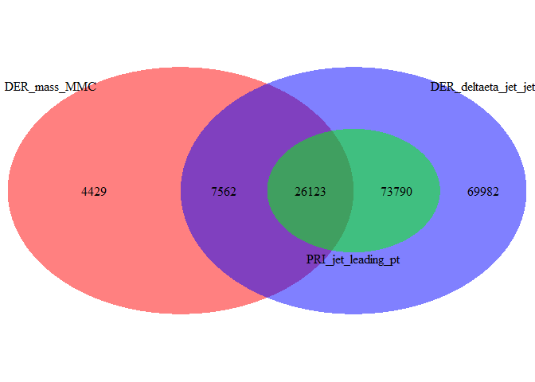
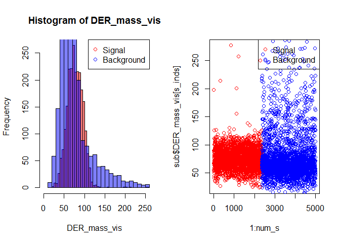
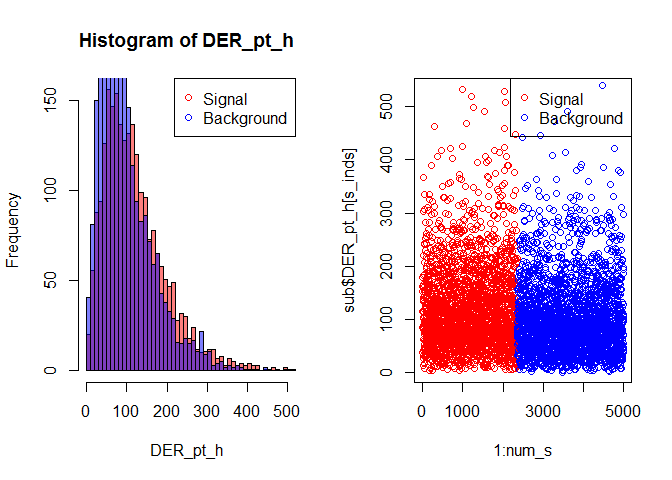
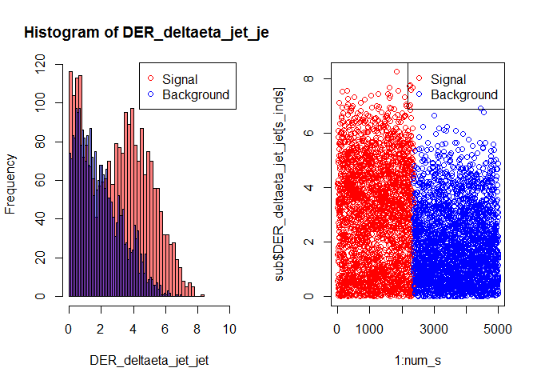

# Higgs-ML summary
Rail Suleymanov  
Monday, February 02, 2015  

# Load data
## Training data
Read training data, find number of missing points for each variable, remove missing points.

```r
train_f <- "training.csv"
train <- read.csv(train_f)
train_no_na <- data.frame(train)
features <- colnames(train)
nas1 <- vector("integer", length = length(features))
for (feature in seq_along(features)) {
    ina <- train[, feature] == -999.0
    nas1[feature] <- sum(ina)
}
for (feature in seq_along(features)) {
    ina <- train_no_na[, feature] == -999.0
    train_no_na <- train_no_na[!ina, ]
}
```

Number of missing values for each variable.

```r
library(ggplot2)
```

```
## Warning: package 'ggplot2' was built under R version 3.1.2
```

```r
nas <- data.frame(features, nas1)
nas <- nas[nas1 != 0, ]
q <- qplot(x = features, y = nas1, data = nas, geom = "bar", stat = "identity")
q + theme(axis.text.x = element_text(angle = 90)) + xlab("Number of missing values")
```

 

Check if there are full matching na's in different features. That can be the case in variables **DER_deltaeta_jet_jet** (6-th variable), **DER_mass_jet_jet** (7-th), **DER_prodeta_jet_jet** (8-th), **DER_lep_eta_centrality** (14-th), **PRI_jet_subleading_pt** (28-th), **PRI_jet_subleading_eta** (29-th), **PRI_jet_subleading_phi** (30-th) and in variables **PRI_jet_leading_pt** (25-th), **PRI_jet_leading_eta** (26-th), **PRI_jet_leading_phi** (27-th).

```r
ina6 <- which(train$DER_deltaeta_jet_jet == -999)
ina7 <- which(train$DER_mass_jet_jet == -999)
ina8 <- which(train$DER_prodeta_jet_jet == -999)
ina14 <- which(train$DER_lep_eta_centrality == -999)
ina28 <- which(train$PRI_jet_subleading_pt == -999)
ina29 <- which(train$PRI_jet_subleading_eta == -999)
ina30 <- which(train$PRI_jet_subleading_phi == -999)

match_res <- sum(intersect(ina6, ina7) == ina6) == length(ina7)
match_res <- sum(intersect(ina6, ina8) == ina6) == length(ina8)
match_res <- sum(intersect(ina6, ina14) == ina6) == length(ina14)
match_res <- sum(intersect(ina6, ina28) == ina6) == length(ina28)
match_res <- sum(intersect(ina6, ina29) == ina6) == length(ina29)
match_res <- sum(intersect(ina6, ina30) == ina6) == length(ina30)
```

Do all na's in those variables match? TRUE


```r
ina25 <- which(train$PRI_jet_leading_pt == -999.0)
ina26 <- which(train$PRI_jet_leading_eta == -999.0)
ina27 <- which(train$PRI_jet_leading_phi == -999.0)

match_res <- sum(intersect(ina25, ina26) == ina25) == length(ina26)
match_res <- sum(intersect(ina25, ina27) == ina27) == length(ina27)
```

Do all na's in those variables match? TRUE

We see that there's indeed full matching of these features. Now let's explore how do indexes of NA features intersect for **DER_mass_MMC**, **DER_deltaeta_jet_jet** and **PRI_jet_leading_pt**.

```r
library(VennDiagram)
```

```
## Warning: package 'VennDiagram' was built under R version 3.1.2
```

```
## Loading required package: grid
```

```r
ina2 <- which(train$DER_mass_MMC == -999)
area1 <- length(ina6)
area2 <- length(ina2)
area3 <- length(ina25)
in12 <- length(intersect(ina6, ina2))
in13 <- length(intersect(ina6, ina25))
in23 <- length(intersect(ina2, ina25))
in123 <- length(intersect(ina6, intersect(ina2, ina25)))

venn.plot <- draw.triple.venn(area1, area2, area3, in12, in23, in13, in123, 
                              category = c("DER_deltaeta_jet_jet", "DER_mass_MMC", "PRI_jet_leading_pt"),
                              fill = c("blue", "red", "green"),
                              lty = "blank", cat.col = rep("black", 3))
```

 


## Test data
Read test data, find number of missing points for each variable, remove missing points.

```r
test_f <- "test.csv"
test <- read.csv(test_f)
test_no_na <- data.frame(test)
features <- colnames(test)
nas2 <- vector("integer", length = length(features))
for (feature in seq_along(features)) {
    ina <- test[, feature] == -999.0
    nas2[feature] <- sum(ina)
}
for (feature in seq_along(features)) {
    ina <- test_no_na[, feature] == -999.0
    test_no_na <- test_no_na[!ina, ]
}
```

Number of missing values for each variable.

```r
nas <- data.frame(features, nas2)
nas <- nas[nas2 != 0, ]
q <- qplot(x = features, y = nas2, data = nas, geom = "bar", stat = "identity")
q + theme(axis.text.x = element_text(angle = 90)) + xlab("Number of missing values")
```

 

Perform same na's matching for test set as it was for training set

```r
ina6 <- which(test$DER_deltaeta_jet_jet == -999)
ina7 <- which(test$DER_mass_jet_jet == -999)
ina8 <- which(test$DER_prodeta_jet_jet == -999)
ina14 <- which(test$DER_lep_eta_centrality == -999)
ina28 <- which(test$PRI_jet_subleading_pt == -999)
ina29 <- which(test$PRI_jet_subleading_eta == -999)
ina30 <- which(test$PRI_jet_subleading_phi == -999)

match_res <- sum(intersect(ina6, ina7) == ina6) == length(ina7)
match_res <- sum(intersect(ina6, ina8) == ina6) == length(ina8)
match_res <- sum(intersect(ina6, ina14) == ina6) == length(ina14)
match_res <- sum(intersect(ina6, ina28) == ina6) == length(ina28)
match_res <- sum(intersect(ina6, ina29) == ina6) == length(ina29)
match_res <- sum(intersect(ina6, ina30) == ina6) == length(ina30)
```

Do all na's in those variables match? TRUE


```r
ina25 <- which(test$PRI_jet_leading_pt == -999.0)
ina26 <- which(test$PRI_jet_leading_eta == -999.0)
ina27 <- which(test$PRI_jet_leading_phi == -999.0)

match_res <- sum(intersect(ina25, ina26) == ina25) == length(ina26)
match_res <- sum(intersect(ina25, ina27) == ina27) == length(ina27)
```

Do all na's in those variables match? TRUE

We see that there's indeed full matching of these features. Now let's explore how do indexes of NA features intersect for **DER_mass_MMC**, **DER_deltaeta_jet_jet** and **PRI_jet_leading_pt**.

```r
library(VennDiagram)
ina2 <- which(test$DER_mass_MMC == -999)
area1 <- length(ina6)
area2 <- length(ina2)
area3 <- length(ina25)
in12 <- length(intersect(ina6, ina2))
in13 <- length(intersect(ina6, ina25))
in23 <- length(intersect(ina2, ina25))
in123 <- length(intersect(ina6, intersect(ina2, ina25)))

venn.plot <- draw.triple.venn(area1, area2, area3, in12, in23, in13, in123, 
                              category = c("DER_deltaeta_jet_jet", "DER_mass_MMC", "PRI_jet_leading_pt"),
                              fill = c("blue", "red", "green"),
                              lty = "blank", cat.col = rep("black", 3))
```

 

# Conclusion
According to NA's structure investigation, 2 strategies are possible:

1. As there's complete NA-matching between several sets of variables, we can conclude that whole dataset can be divided to following parts

 - examples having all variables defined (i.e. without indexes that go into coloured regions on the last figure) - set A

 - examples that didn't go to 'set A', having all variables defined except variable **DER_mass_MMC** (coloured red) - set B

 - examples that didn't go to previous sets, having all variables defined except variable **DER_deltaeta_jet_jet** (coloured blue) - set C
 
 - examples that didn't go to previous sets, having all variables defined except variables **DER_mass_MMC** AND **DER_deltaeta_jet_jet** (coloured purple) - set D

 - examples that didn't go to previous sets, having all variables defined except variables **DER_deltaeta_jet_jet** AND **PRI_jet_leading_pt** (light green) - set E

 - examples that didn't go to previous sets, having all variables defined except variables **DER_mass_MMC**, **DER_deltaeta_jet_jet** AND **PRI_jet_leading_pt** (dark green, the intersection of all 3 regions) - set F
 
2. Leave dataset 'asis' but then need to fill NA's using algorithm one of

 - variable means
 
 - generate randoms from that variable's distributions
 
 - k-nearest neighbors
 
 - k-means clustering

# Details of some of features
We will choose subset from train data (without NAs) and plot its details.

```r
s_train <- summary(train_no_na)
ind <- sample(1:dim(train_no_na)[1], size = 5000, replace = F)
sub <- train_no_na[ind, ]
s_inds <- sub$Label == "s"
b_inds <- sub$Label == "b"
num_s <- length(sub$Label[s_inds])
num_b <- length(sub$Label[b_inds])
```

## 1) Estimated mass of the Higgs boson candidate (DER_mass_MMC)

```r
main <- "Histogram of DER_mass_MMC"
xlab <- "DER_mass_MMC"
ylab <- "Frequency"
leg <- c("Signal", "Background")
par(mfrow = c(1, 2))
hist(sub$DER_mass_MMC[s_inds], breaks = 50, col = rgb(1, 0, 0, 0.5), 
     xlab = xlab, ylab = ylab, main = main, xlim = c(0, 500))
hist(sub$DER_mass_MMC[b_inds], breaks = 50, col = rgb(0, 0, 1, 0.5), add = T)
legend("topright", pch = 1, col = c("red", "blue"), legend = leg)
plot(1:num_s, sub$DER_mass_MMC[s_inds], col = "red", xlim = c(0, 5000))
points((num_s+1):5000, sub$DER_mass_MMC[b_inds], col = "blue")
legend("topright", pch = 1, col = c("red", "blue"), legend = leg)
```

 

Train set statistics: Min.   :  9.878  , 1st Qu.: 93.320  , Median :113.230  , Mean   :122.816  , 3rd Qu.:133.456  , Max.   :988.199  

## 2) Transverse mass between the missing transverse energy and the lepton (DER_mass_transverse_met_lep)

```r
main <- "Histogram of DER_mass_transverse_met_lep"
xlab <- "DER_mass_transverse_met_lep"
ylab <- "Frequency"
leg <- c("Signal", "Background")
par(mfrow = c(1, 2))
hist(sub$DER_mass_transverse_met_lep[s_inds], breaks = 50, col = rgb(1, 0, 0, 0.5), 
     xlab = xlab, ylab = ylab, main = main, xlim = c(0, 250))
hist(sub$DER_mass_transverse_met_lep[b_inds], breaks = 50, col = rgb(0, 0, 1, 0.5), add = T)
legend("topright", pch = 1, col = c("red", "blue"), legend = leg)
plot(1:num_s, sub$DER_mass_transverse_met_lep[s_inds], col = "red", xlim = c(0, 5000))
points((num_s+1):5000, sub$DER_mass_transverse_met_lep[b_inds], col = "blue")
legend("topright", pch = 1, col = c("red", "blue"), legend = leg)
```

 

Train set statistics: Min.   :  0.00  , 1st Qu.: 11.32  , Median : 26.96  , Mean   : 35.27  , 3rd Qu.: 52.20  , Max.   :594.29  

## 3) Invariant mass of the hadronic tau and the lepton (DER_mass_vis)

```r
main <- "Histogram of DER_mass_vis"
xlab <- "DER_mass_vis"
ylab <- "Frequency"
leg <- c("Signal", "Background")
par(mfrow = c(1, 2))
hist(sub$DER_mass_vis[s_inds], breaks = 50, col = rgb(1, 0, 0, 0.5), 
     xlab = xlab, ylab = ylab, main = main, xlim = c(0, 250))
hist(sub$DER_mass_vis[b_inds], breaks = 50, col = rgb(0, 0, 1, 0.5), add = T)
legend("topright", pch = 1, col = c("red", "blue"), legend = leg)
plot(1:num_s, sub$DER_mass_vis[s_inds], col = "red", xlim = c(0, 5000))
points((num_s+1):5000, sub$DER_mass_vis[b_inds], col = "blue")
legend("topright", pch = 1, col = c("red", "blue"), legend = leg)
```

 

Train set statistics: Min.   :  7.33  , 1st Qu.: 57.27  , Median : 70.93  , Mean   : 78.50  , 3rd Qu.: 88.37  , Max.   :789.54  

## 4) Modulus of the vector sum of the transverse momentum of the hadronic tau, the lepton,
## and the missing transverse energy vector (DER_pt_h)

```r
main <- "Histogram of DER_pt_h"
xlab <- "DER_pt_h"
ylab <- "Frequency"
leg <- c("Signal", "Background")
par(mfrow = c(1, 2))
hist(sub$DER_pt_h[s_inds], breaks = 50, col = rgb(1, 0, 0, 0.5), 
     xlab = xlab, ylab = ylab, main = main, xlim = c(0, 500))
hist(sub$DER_pt_h[b_inds], breaks = 50, col = rgb(0, 0, 1, 0.5), add = T)
legend("topright", pch = 1, col = c("red", "blue"), legend = leg)
plot(1:num_s, sub$DER_pt_h[s_inds], col = "red", xlim = c(0, 5000))
points((num_s+1):5000, sub$DER_pt_h[b_inds], col = "blue")
legend("topright", pch = 1, col = c("red", "blue"), legend = leg)
```

 

Train set statistics: Min.   :   0.12  , 1st Qu.:  57.83  , Median :  94.71  , Mean   : 111.43  , 3rd Qu.: 145.82  , Max.   :1053.81  

## 5) Absolute value of the pseudorapidity separation between the two jets (DER_deltaeta_jet_jet)

```r
main <- "Histogram of DER_deltaeta_jet_jet"
xlab <- "DER_deltaeta_jet_jet"
ylab <- "Frequency"
leg <- c("Signal", "Background")
par(mfrow = c(1, 2))
hist(sub$DER_deltaeta_jet_jet[s_inds], breaks = 50, col = rgb(1, 0, 0, 0.5), 
     xlab = xlab, ylab = ylab, main = main, xlim = c(0, 10))
hist(sub$DER_deltaeta_jet_jet[b_inds], breaks = 50, col = rgb(0, 0, 1, 0.5), add = T)
legend("topright", pch = 1, col = c("red", "blue"), legend = leg)
plot(1:num_s, sub$DER_deltaeta_jet_jet[s_inds], col = "red", xlim = c(0, 5000))
points((num_s+1):5000, sub$DER_deltaeta_jet_jet[b_inds], col = "blue")
legend("topright", pch = 1, col = c("red", "blue"), legend = leg)
```

 

Train set statistics: Min.   :0.000  , 1st Qu.:0.897  , Median :2.147  , Mean   :2.434  , 3rd Qu.:3.741  , Max.   :8.503  

## 6) The invariant mass of the two jets (DER_mass_jet_jet)

```r
main <- "Histogram of DER_mass_jet_jet"
xlab <- "DER_mass_jet_jet"
ylab <- "Frequency"
leg <- c("Signal", "Background")
par(mfrow = c(1, 2))
hist(sub$DER_mass_jet_jet[s_inds], breaks = 50, col = rgb(1, 0, 0, 0.5), 
     xlab = xlab, ylab = ylab, main = main, xlim = c(0, 3000))
hist(sub$DER_mass_jet_jet[b_inds], breaks = 50, col = rgb(0, 0, 1, 0.5), add = T)
legend("topright", pch = 1, col = c("red", "blue"), legend = leg)
plot(1:num_s, sub$DER_mass_jet_jet[s_inds], col = "red", xlim = c(0, 5000))
points((num_s+1):5000, sub$DER_mass_jet_jet[b_inds], col = "blue")
legend("topright", pch = 1, col = c("red", "blue"), legend = leg)
```

 

Train set statistics: Min.   :  13.6  , 1st Qu.: 113.5  , Median : 232.4  , Mean   : 378.2  , 3rd Qu.: 489.4  , Max.   :4975.0  

## 7) The product of the pseudorapidities of the two jets (DER_prodeta_jet_jet)

```r
main <- "Histogram of DER_prodeta_jet_jet"
xlab <- "DER_prodeta_jet_jet"
ylab <- "Frequency"
leg <- c("Signal", "Background")
par(mfrow = c(1, 2))
hist(sub$DER_prodeta_jet_jet[s_inds], breaks = 50, col = rgb(1, 0, 0, 0.5), 
     xlab = xlab, ylab = ylab, main = main, xlim = c(-15, 15))
hist(sub$DER_prodeta_jet_jet[b_inds], breaks = 50, col = rgb(0, 0, 1, 0.5), add = T)
legend("topright", pch = 1, col = c("red", "blue"), legend = leg)
plot(1:num_s, sub$DER_prodeta_jet_jet[s_inds], col = "red", xlim = c(0, 5000))
points((num_s+1):5000, sub$DER_prodeta_jet_jet[b_inds], col = "blue")
legend("topright", pch = 1, col = c("red", "blue"), legend = leg)
```

 

Train set statistics: Min.   :-18.066  , 1st Qu.: -2.729  , Median : -0.284  , Mean   : -0.881  , 3rd Qu.:  0.921  , Max.   : 16.648  

## 8) The R separation between the hadronic tau and the lepton (DER_deltar_tau_lep)

```r
main <- "Histogram of DER_deltar_tau_lep"
xlab <- "DER_deltar_tau_lep"
ylab <- "Frequency"
leg <- c("Signal", "Background")
par(mfrow = c(1, 2))
hist(sub$DER_deltar_tau_lep[s_inds], breaks = 50, col = rgb(1, 0, 0, 0.5), 
     xlab = xlab, ylab = ylab, main = main, xlim = c(0, 4))
hist(sub$DER_deltar_tau_lep[b_inds], breaks = 50, col = rgb(0, 0, 1, 0.5), add = T)
legend("topright", pch = 1, col = c("red", "blue"), legend = leg)
plot(1:num_s, sub$DER_deltar_tau_lep[s_inds], col = "red", xlim = c(0, 5000))
points((num_s+1):5000, sub$DER_deltar_tau_lep[b_inds], col = "blue")
legend("topright", pch = 1, col = c("red", "blue"), legend = leg)
```

 

Train set statistics: Min.   :0.228  , 1st Qu.:1.397  , Median :1.940  , Mean   :1.997  , 3rd Qu.:2.574  , Max.   :5.579  

## 9) The modulus of the vector sum of the missing transverse momenta and the transverse momenta of th ehadronic tau, the lepton, the leading jet and the subleading jet (DER_pt_tot)

```r
main <- "Histogram of DER_pt_tot"
xlab <- "DER_pt_tot"
ylab <- "Frequency"
leg <- c("Signal", "Background")
par(mfrow = c(1, 2))
hist(sub$DER_pt_tot[s_inds], breaks = 50, col = rgb(1, 0, 0, 0.5), 
     xlab = xlab, ylab = ylab, main = main, xlim = c(0, 200))
hist(sub$DER_pt_tot[b_inds], breaks = 50, col = rgb(0, 0, 1, 0.5), add = T)
legend("topright", pch = 1, col = c("red", "blue"), legend = leg)
plot(1:num_s, sub$DER_pt_tot[s_inds], col = "red", xlim = c(0, 5000))
points((num_s+1):5000, sub$DER_pt_tot[b_inds], col = "blue")
legend("topright", pch = 1, col = c("red", "blue"), legend = leg)
```

 

Train set statistics: Min.   :  0.004  , 1st Qu.:  4.218  , Median : 22.542  , Mean   : 27.357  , 3rd Qu.: 39.068  , Max.   :466.525  

## 10) The sum of the moduli of the transverse momenta of the hadronic tau, the lepton, the leading jet and the subleading jet (DER_sum_pt)

```r
main <- "Histogram of DER_sum_pt"
xlab <- "DER_sum_pt"
ylab <- "Frequency"
leg <- c("Signal", "Background")
par(mfrow = c(1, 2))
hist(sub$DER_sum_pt[s_inds], breaks = 50, col = rgb(1, 0, 0, 0.5), 
     xlab = xlab, ylab = ylab, main = main, xlim = c(0, 1000))
hist(sub$DER_sum_pt[b_inds], breaks = 50, col = rgb(0, 0, 1, 0.5), add = T)
legend("topright", pch = 1, col = c("red", "blue"), legend = leg)
plot(1:num_s, sub$DER_sum_pt[s_inds], col = "red", xlim = c(0, 5000))
points((num_s+1):5000, sub$DER_sum_pt[b_inds], col = "blue")
legend("topright", pch = 1, col = c("red", "blue"), legend = leg)
```

 

Train set statistics: Min.   : 110.6  , 1st Qu.: 192.8  , Median : 246.7  , Mean   : 281.5  , 3rd Qu.: 331.1  , Max.   :1852.5  

## 11) The ratio of the transverse momenta of the lepton and the hadronic tau (DER_pt_ratio_lep_tau)

```r
main <- "Histogram of DER_pt_ratio_lep_tau"
xlab <- "DER_pt_ratio_lep_tau"
ylab <- "Frequency"
leg <- c("Signal", "Background")
par(mfrow = c(1, 2))
hist(sub$DER_pt_ratio_lep_tau[s_inds], breaks = 50, col = rgb(1, 0, 0, 0.5), 
     xlab = xlab, ylab = ylab, main = main, xlim = c(0, 10))
hist(sub$DER_pt_ratio_lep_tau[b_inds], breaks = 50, col = rgb(0, 0, 1, 0.5), add = T)
legend("topright", pch = 1, col = c("red", "blue"), legend = leg)
plot(1:num_s, sub$DER_pt_ratio_lep_tau[s_inds], col = "red", xlim = c(0, 5000))
points((num_s+1):5000, sub$DER_pt_ratio_lep_tau[b_inds], col = "blue")
legend("topright", pch = 1, col = c("red", "blue"), legend = leg)
```

 

Train set statistics: Min.   : 0.0470  , 1st Qu.: 0.7622  , Median : 1.2060  , Mean   : 1.4809  , 3rd Qu.: 1.8540  , Max.   :19.7730  

## 12) The centrality of the azimutal angle of the missing transverse energy vector wrt the hadronic tau and the lepton (DER_met_phi_centrality)

```r
main <- "Histogram of DER_met_phi_centrality"
xlab <- "DER_met_phi_centrality"
ylab <- "Frequency"
leg <- c("Signal", "Background")
par(mfrow = c(1, 2))
hist(sub$DER_met_phi_centrality[s_inds], breaks = 50, col = rgb(1, 0, 0, 0.5), 
     xlab = xlab, ylab = ylab, main = main, xlim = c(-1.5, 1.5))
hist(sub$DER_met_phi_centrality[b_inds], breaks = 50, col = rgb(0, 0, 1, 0.5), add = T)
legend("topright", pch = 1, col = c("red", "blue"), legend = leg)
plot(1:num_s, sub$DER_met_phi_centrality[s_inds], col = "red", xlim = c(0, 5000))
points((num_s+1):5000, sub$DER_met_phi_centrality[b_inds], col = "blue")
legend("topright", pch = 1, col = c("red", "blue"), legend = leg)
```

 

Train set statistics: Min.   :-1.4140  , 1st Qu.: 0.1910  , Median : 1.0710  , Mean   : 0.6373  , 3rd Qu.: 1.3420  , Max.   : 1.4140  

## 13) The centrality of the pseudorapidity of the lepton wrt the two jets (DER_lep_eta_centrality)

```r
main <- "Histogram of DER_lep_eta_centrality"
xlab <- "DER_lep_eta_centrality"
ylab <- "Frequency"
leg <- c("Signal", "Background")
par(mfrow = c(1, 2))
hist(sub$DER_lep_eta_centrality[s_inds], breaks = 50, col = rgb(1, 0, 0, 0.5), 
     xlab = xlab, ylab = ylab, main = main, xlim = c(0, 1))
hist(sub$DER_lep_eta_centrality[b_inds], breaks = 50, col = rgb(0, 0, 1, 0.5), add = T)
legend("topright", pch = 1, col = c("red", "blue"), legend = leg)
plot(1:num_s, sub$DER_lep_eta_centrality[s_inds], col = "red", xlim = c(0, 5000))
points((num_s+1):5000, sub$DER_lep_eta_centrality[b_inds], col = "blue")
legend("topright", pch = 1, col = c("red", "blue"), legend = leg)
```

 

Train set statistics: Min.   :0.0000  , 1st Qu.:0.0050  , Median :0.4690  , Mean   :0.4638  , 3rd Qu.:0.8830  , Max.   :1.0000  

## 14) The transverse momentum of the hadronic tau (PRI_tau_pt)

```r
main <- "Histogram of PRI_tau_pt"
xlab <- "PRI_tau_pt"
ylab <- "Frequency"
leg <- c("Signal", "Background")
par(mfrow = c(1, 2))
hist(sub$PRI_tau_pt[s_inds], breaks = 50, col = rgb(1, 0, 0, 0.5), 
     xlab = xlab, ylab = ylab, main = main, xlim = c(0, 300))
hist(sub$PRI_tau_pt[b_inds], breaks = 50, col = rgb(0, 0, 1, 0.5), add = T)
legend("topright", pch = 1, col = c("red", "blue"), legend = leg)
plot(1:num_s, sub$PRI_tau_pt[s_inds], col = "red", xlim = c(0, 5000))
points((num_s+1):5000, sub$PRI_tau_pt[b_inds], col = "blue")
legend("topright", pch = 1, col = c("red", "blue"), legend = leg)
```

 

Train set statistics: Min.   : 20.00  , 1st Qu.: 26.59  , Median : 36.59  , Mean   : 45.72  , 3rd Qu.: 54.19  , Max.   :622.86  

## 15) The pseudorapidity of the hadronic tau (PRI_tau_eta)

```r
main <- "Histogram of PRI_tau_eta"
xlab <- "PRI_tau_eta"
ylab <- "Frequency"
leg <- c("Signal", "Background")
par(mfrow = c(1, 2))
hist(sub$PRI_tau_eta[s_inds], breaks = 50, col = rgb(1, 0, 0, 0.5), 
     xlab = xlab, ylab = ylab, main = main, xlim = c(-3, 3))
hist(sub$PRI_tau_eta[b_inds], breaks = 50, col = rgb(0, 0, 1, 0.5), add = T)
legend("topright", pch = 1, col = c("red", "blue"), legend = leg)
plot(1:num_s, sub$PRI_tau_eta[s_inds], col = "red", xlim = c(0, 5000))
points((num_s+1):5000, sub$PRI_tau_eta[b_inds], col = "blue")
legend("topright", pch = 1, col = c("red", "blue"), legend = leg)
```

 

Train set statistics: Min.   :-2.496000  , 1st Qu.:-0.889000  , Median :-0.011000  , Mean   :-0.003367  , 3rd Qu.: 0.879750  , Max.   : 2.497000  

## 16) The azimuth angle of the hadronic tau (PRI_tau_phi)

```r
main <- "Histogram of PRI_tau_phi"
xlab <- "PRI_tau_phi"
ylab <- "Frequency"
leg <- c("Signal", "Background")
par(mfrow = c(1, 2))
hist(sub$PRI_tau_phi[s_inds], breaks = 50, col = rgb(1, 0, 0, 0.5), 
     xlab = xlab, ylab = ylab, main = main, xlim = c(-3, 3))
hist(sub$PRI_tau_phi[b_inds], breaks = 50, col = rgb(0, 0, 1, 0.5), add = T)
legend("topright", pch = 1, col = c("red", "blue"), legend = leg)
plot(1:num_s, sub$PRI_tau_phi[s_inds], col = "red", xlim = c(0, 5000))
points((num_s+1):5000, sub$PRI_tau_phi[b_inds], col = "blue")
legend("topright", pch = 1, col = c("red", "blue"), legend = leg)
```

 

Train set statistics: Min.   :-3.141000  , 1st Qu.:-1.570000  , Median :-0.010000  , Mean   : 0.001104  , 3rd Qu.: 1.580000  , Max.   : 3.142000  

## 17) The transverse momentum of the lepton - electron or muon (PRI_lep_pt)

```r
main <- "Histogram of PRI_lep_pt"
xlab <- "PRI_lep_pt"
ylab <- "Frequency"
leg <- c("Signal", "Background")
par(mfrow = c(1, 2))
hist(sub$PRI_lep_pt[s_inds], breaks = 50, col = rgb(1, 0, 0, 0.5), 
     xlab = xlab, ylab = ylab, main = main, xlim = c(0, 250))
hist(sub$PRI_lep_pt[b_inds], breaks = 50, col = rgb(0, 0, 1, 0.5), add = T)
legend("topright", pch = 1, col = c("red", "blue"), legend = leg)
plot(1:num_s, sub$PRI_lep_pt[s_inds], col = "red", xlim = c(0, 5000))
points((num_s+1):5000, sub$PRI_lep_pt[b_inds], col = "blue")
legend("topright", pch = 1, col = c("red", "blue"), legend = leg)
```

 

Train set statistics: Min.   : 26.00  , 1st Qu.: 33.28  , Median : 43.45  , Mean   : 52.43  , 3rd Qu.: 61.48  , Max.   :461.90  

## 18) The pseudorapidity of the lepton (PRI_lep_eta)

```r
main <- "Histogram of PRI_lep_eta"
xlab <- "PRI_lep_eta"
ylab <- "Frequency"
leg <- c("Signal", "Background")
par(mfrow = c(1, 2))
hist(sub$PRI_lep_eta[s_inds], breaks = 50, col = rgb(1, 0, 0, 0.5), 
     xlab = xlab, ylab = ylab, main = main, xlim = c(-3, 3))
hist(sub$PRI_lep_eta[b_inds], breaks = 50, col = rgb(0, 0, 1, 0.5), add = T)
legend("topright", pch = 1, col = c("red", "blue"), legend = leg)
plot(1:num_s, sub$PRI_lep_eta[s_inds], col = "red", xlim = c(0, 5000))
points((num_s+1):5000, sub$PRI_lep_eta[b_inds], col = "blue")
legend("topright", pch = 1, col = c("red", "blue"), legend = leg)
```

 

Train set statistics: Min.   :-2.487000  , 1st Qu.:-0.908750  , Median :-0.009000  , Mean   :-0.003671  , 3rd Qu.: 0.904000  , Max.   : 2.499000  

## 19) The azimuth angle of the lepton (PRI_lep_phi)

```r
main <- "Histogram of PRI_lep_phi"
xlab <- "PRI_lep_phi"
ylab <- "Frequency"
leg <- c("Signal", "Background")
par(mfrow = c(1, 2))
hist(sub$PRI_lep_phi[s_inds], breaks = 50, col = rgb(1, 0, 0, 0.5), 
     xlab = xlab, ylab = ylab, main = main, xlim = c(-3, 3))
hist(sub$PRI_lep_phi[b_inds], breaks = 50, col = rgb(0, 0, 1, 0.5), add = T)
legend("topright", pch = 1, col = c("red", "blue"), legend = leg)
plot(1:num_s, sub$PRI_lep_phi[s_inds], col = "red", xlim = c(0, 5000))
points((num_s+1):5000, sub$PRI_lep_phi[b_inds], col = "blue")
legend("topright", pch = 1, col = c("red", "blue"), legend = leg)
```

 

Train set statistics: Min.   :-3.1420  , 1st Qu.:-1.5180  , Median : 0.0770  , Mean   : 0.0419  , 3rd Qu.: 1.6090  , Max.   : 3.1410  

## 20) The missing transverse energy (PRI_met)

```r
main <- "Histogram of PRI_met"
xlab <- "PRI_met"
ylab <- "Frequency"
leg <- c("Signal", "Background")
par(mfrow = c(1, 2))
hist(sub$PRI_met[s_inds], breaks = 50, col = rgb(1, 0, 0, 0.5), 
     xlab = xlab, ylab = ylab, main = main, xlim = c(0, 400))
hist(sub$PRI_met[b_inds], breaks = 50, col = rgb(0, 0, 1, 0.5), add = T)
legend("topright", pch = 1, col = c("red", "blue"), legend = leg)
plot(1:num_s, sub$PRI_met[s_inds], col = "red", xlim = c(0, 5000))
points((num_s+1):5000, sub$PRI_met[b_inds], col = "blue")
legend("topright", pch = 1, col = c("red", "blue"), legend = leg)
```

 

Train set statistics: Min.   :  0.20  , 1st Qu.: 27.08  , Median : 44.29  , Mean   : 54.96  , 3rd Qu.: 69.42  , Max.   :951.36  

## 21) The azimuth angle of the missing transverse energy (PRI_met_phi)

```r
main <- "Histogram of PRI_met_phi"
xlab <- "PRI_met_phi"
ylab <- "Frequency"
leg <- c("Signal", "Background")
par(mfrow = c(1, 2))
hist(sub$PRI_met_phi[s_inds], breaks = 50, col = rgb(1, 0, 0, 0.5), 
     xlab = xlab, ylab = ylab, main = main, xlim = c(-3, 3))
hist(sub$PRI_met_phi[b_inds], breaks = 50, col = rgb(0, 0, 1, 0.5), add = T)
legend("topright", pch = 1, col = c("red", "blue"), legend = leg)
plot(1:num_s, sub$PRI_met_phi[s_inds], col = "red", xlim = c(0, 5000))
points((num_s+1):5000, sub$PRI_met_phi[b_inds], col = "blue")
legend("topright", pch = 1, col = c("red", "blue"), legend = leg)
```

 

Train set statistics: Min.   :-3.142000  , 1st Qu.:-1.550000  , Median : 0.005000  , Mean   : 0.006987  , 3rd Qu.: 1.573000  , Max.   : 3.142000  

## 22) The total transverse energy in the detector (PRI_met_sumet)

```r
main <- "Histogram of PRI_met_sumet"
xlab <- "PRI_met_sumet"
ylab <- "Frequency"
leg <- c("Signal", "Background")
par(mfrow = c(1, 2))
hist(sub$PRI_met_sumet[s_inds], breaks = 50, col = rgb(1, 0, 0, 0.5), 
     xlab = xlab, ylab = ylab, main = main, xlim = c(0, 1000))
hist(sub$PRI_met_sumet[b_inds], breaks = 50, col = rgb(0, 0, 1, 0.5), add = T)
legend("topright", pch = 1, col = c("red", "blue"), legend = leg)
plot(1:num_s, sub$PRI_met_sumet[s_inds], col = "red", xlim = c(0, 5000))
points((num_s+1):5000, sub$PRI_met_sumet[b_inds], col = "blue")
legend("topright", pch = 1, col = c("red", "blue"), legend = leg)
```

 

Train set statistics: Min.   :  34.32  , 1st Qu.: 239.17  , Median : 305.17  , Mean   : 334.68  , 3rd Qu.: 396.38  , Max.   :2003.98  

## 23) The transverse momentum of the leading jet, that is the jet with largest transverse momentum (PRI_jet_leading_pt)

```r
main <- "Histogram of PRI_jet_leading_pt"
xlab <- "PRI_jet_leading_pt"
ylab <- "Frequency"
leg <- c("Signal", "Background")
par(mfrow = c(1, 2))
hist(sub$PRI_jet_leading_pt[s_inds], breaks = 50, col = rgb(1, 0, 0, 0.5), 
     xlab = xlab, ylab = ylab, main = main, xlim = c(0, 600))
hist(sub$PRI_jet_leading_pt[b_inds], breaks = 50, col = rgb(0, 0, 1, 0.5), add = T)
legend("topright", pch = 1, col = c("red", "blue"), legend = leg)
plot(1:num_s, sub$PRI_jet_leading_pt[s_inds], col = "red", xlim = c(0, 5000))
points((num_s+1):5000, sub$PRI_jet_leading_pt[b_inds], col = "blue")
legend("topright", pch = 1, col = c("red", "blue"), legend = leg)
```

 

Train set statistics: Min.   :2.000  , 1st Qu.:2.000  , Median :2.000  , Mean   :2.304  , 3rd Qu.:3.000  , Max.   :3.000  

## 24) The pseudorapidity of the leading jet (PRI_jet_leading_eta)

```r
main <- "Histogram of PRI_jet_leading_eta"
xlab <- "PRI_jet_leading_eta"
ylab <- "Frequency"
leg <- c("Signal", "Background")
par(mfrow = c(1, 2))
hist(sub$PRI_jet_leading_eta[s_inds], breaks = 50, col = rgb(1, 0, 0, 0.5), 
     xlab = xlab, ylab = ylab, main = main, xlim = c(-4, 4))
hist(sub$PRI_jet_leading_eta[b_inds], breaks = 50, col = rgb(0, 0, 1, 0.5), add = T)
legend("topright", pch = 1, col = c("red", "blue"), legend = leg)
plot(1:num_s, sub$PRI_jet_leading_eta[s_inds], col = "red", xlim = c(0, 5000))
points((num_s+1):5000, sub$PRI_jet_leading_eta[b_inds], col = "blue")
legend("topright", pch = 1, col = c("red", "blue"), legend = leg)
```

 

Train set statistics: Min.   :  30.20  , 1st Qu.:  60.84  , Median :  87.37  , Mean   : 106.88  , 3rd Qu.: 131.07  , Max.   :1120.57  

## 25) The azimuth angle of the leading jet (PRI_jet_leading_phi)

```r
main <- "Histogram of PRI_jet_leading_phi"
xlab <- "PRI_jet_leading_phi"
ylab <- "Frequency"
leg <- c("Signal", "Background")
par(mfrow = c(1, 2))
hist(sub$PRI_jet_leading_phi[s_inds], breaks = 50, col = rgb(1, 0, 0, 0.5), 
     xlab = xlab, ylab = ylab, main = main, xlim = c(-3, 3))
hist(sub$PRI_jet_leading_phi[b_inds], breaks = 50, col = rgb(0, 0, 1, 0.5), add = T)
legend("topright", pch = 1, col = c("red", "blue"), legend = leg)
plot(1:num_s, sub$PRI_jet_leading_phi[s_inds], col = "red", xlim = c(0, 5000))
points((num_s+1):5000, sub$PRI_jet_leading_phi[b_inds], col = "blue")
legend("topright", pch = 1, col = c("red", "blue"), legend = leg)
```

 

Train set statistics: Min.   :-4.497000  , 1st Qu.:-1.339000  , Median : 0.000000  , Mean   :-0.005791  , 3rd Qu.: 1.330000  , Max.   : 4.499000  

## 26) The transverse momentum of the leading jet, that is, the jet with second largest transverse momentum (PRI_jet_subleading_pt)

```r
main <- "Histogram of PRI_jet_subleading_pt"
xlab <- "PRI_jet_subleading_pt"
ylab <- "Frequency"
leg <- c("Signal", "Background")
par(mfrow = c(1, 2))
hist(sub$PRI_jet_subleading_pt[s_inds], breaks = 50, col = rgb(1, 0, 0, 0.5), 
     xlab = xlab, ylab = ylab, main = main, xlim = c(0, 250))
hist(sub$PRI_jet_subleading_pt[b_inds], breaks = 50, col = rgb(0, 0, 1, 0.5), add = T)
legend("topright", pch = 1, col = c("red", "blue"), legend = leg)
plot(1:num_s, sub$PRI_jet_subleading_pt[s_inds], col = "red", xlim = c(0, 5000))
points((num_s+1):5000, sub$PRI_jet_subleading_pt[b_inds], col = "blue")
legend("topright", pch = 1, col = c("red", "blue"), legend = leg)
```

 

Train set statistics: Min.   :-3.14200  , 1st Qu.:-1.57400  , Median :-0.03200  , Mean   :-0.01156  , 3rd Qu.: 1.55800  , Max.   : 3.14100  

## 27) The pseudorapidity of the subleading jet (PRI_jet_subleading_eta)

```r
main <- "Histogram of PRI_jet_subleading_eta"
xlab <- "PRI_jet_subleading_eta"
ylab <- "Frequency"
leg <- c("Signal", "Background")
par(mfrow = c(1, 2))
hist(sub$PRI_jet_subleading_eta[s_inds], breaks = 50, col = rgb(1, 0, 0, 0.5), 
     xlab = xlab, ylab = ylab, main = main, xlim = c(-5, 5))
hist(sub$PRI_jet_subleading_eta[b_inds], breaks = 50, col = rgb(0, 0, 1, 0.5), add = T)
legend("topright", pch = 1, col = c("red", "blue"), legend = leg)
plot(1:num_s, sub$PRI_jet_subleading_eta[s_inds], col = "red", xlim = c(0, 5000))
points((num_s+1):5000, sub$PRI_jet_subleading_eta[b_inds], col = "blue")
legend("topright", pch = 1, col = c("red", "blue"), legend = leg)
```

 

Train set statistics: Min.   : 30.00  , 1st Qu.: 37.39  , Median : 48.11  , Mean   : 57.92  , 3rd Qu.: 66.95  , Max.   :721.46  

## 28) The azimuth angle of the subleading jet (PRI_jet_subleading_phi)

```r
main <- "Histogram of PRI_jet_subleading_phi"
xlab <- "PRI_jet_subleading_phi"
ylab <- "Frequency"
leg <- c("Signal", "Background")
par(mfrow = c(1, 2))
hist(sub$PRI_jet_subleading_phi[s_inds], breaks = 50, col = rgb(1, 0, 0, 0.5), 
     xlab = xlab, ylab = ylab, main = main, xlim = c(-3, 3))
hist(sub$PRI_jet_subleading_phi[b_inds], breaks = 50, col = rgb(0, 0, 1, 0.5), add = T)
legend("topright", pch = 1, col = c("red", "blue"), legend = leg)
plot(1:num_s, sub$PRI_jet_subleading_phi[s_inds], col = "red", xlim = c(0, 5000))
points((num_s+1):5000, sub$PRI_jet_subleading_phi[b_inds], col = "blue")
legend("topright", pch = 1, col = c("red", "blue"), legend = leg)
```

 

Train set statistics: Min.   :-4.50000  , 1st Qu.:-1.62875  , Median :-0.01400  , Mean   :-0.01293  , 3rd Qu.: 1.60400  , Max.   : 4.50000  

## 29) The scalar sum of the transverse momentum of all the jets of the events (PRI_jet_all_pt)

```r
main <- "Histogram of PRI_jet_all_pt"
xlab <- "PRI_jet_all_pt"
ylab <- "Frequency"
leg <- c("Signal", "Background")
par(mfrow = c(1, 2))
hist(sub$PRI_jet_all_pt[s_inds], breaks = 50, col = rgb(1, 0, 0, 0.5), 
     xlab = xlab, ylab = ylab, main = main, xlim = c(0, 800))
hist(sub$PRI_jet_all_pt[b_inds], breaks = 50, col = rgb(0, 0, 1, 0.5), add = T)
legend("topright", pch = 1, col = c("red", "blue"), legend = leg)
plot(1:num_s, sub$PRI_jet_all_pt[s_inds], col = "red", xlim = c(0, 5000))
points((num_s+1):5000, sub$PRI_jet_all_pt[b_inds], col = "blue")
legend("topright", pch = 1, col = c("red", "blue"), legend = leg)
```

 

Train set statistics: Min.   :-4.50000  , 1st Qu.:-1.62875  , Median :-0.01400  , Mean   :-0.01293  , 3rd Qu.: 1.60400  , Max.   : 4.50000  
